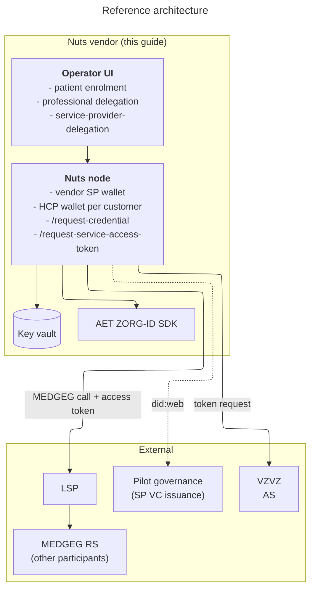

# LSPxNuts Medicatie Overdracht Pilot 1 participation guide for Nuts vendors

This document helps a Nuts vendor scope the work needed to participate in
the LSPxNuts Medicatie Overdracht Pilot 1. It describes what a
participating vendor builds, what they host, what is delivered to them,
and roughly how much effort each piece is. It is not an implementation
manual; once a vendor commits to participating, the detailed setup docs,
sample payloads, and a working reference stack are handed over.

## 1. Scope of this document

The pilot exercises the two-VP (Verifiable Presentation) RFC 7523
jwt-bearer access-token flow for MEDGEG against the Authorization Server
(AS) hosted by VZVZ. There are several participant roles in the pilot.
This guide is aimed at the **Nuts vendors**: parties that operate Nuts
infrastructure and act in the OAuth requestor and client roles. With
the access token obtained from VZVZ, the vendor calls LSP, which routes
to the Resource Server (RS) hosted by other participants. The RS side
is out of scope here.

A Nuts vendor hosts a Nuts node that contains wallets for:

- the vendor itself, as a Service Provider (SP), and
- each of the vendor's care-provider customers, each one a Healthcare
  Provider (HCP).

The vendor builds and operates the issuance UIs that HCP staff use to
manage their credentials. This document is not intended for the HCPs
themselves.

## 2. Effort buckets

Each subsection is marked with one of:

- S - up to half a day
- M - one to two days
- L - three days to a week
- XL - more than a week

These are rough estimates for a backend engineer with prior experience
operating containerized services and no Nuts-specific background. Add
buffer if infra changes have to thread through a multi-step change
process. Items that scale per HCP customer are flagged.

## 3. Reference architecture

## 4. Roles a Nuts vendor plays in the pilot

- OAuth **requestor and client**: the vendor's SP subject calls VZVZ to
  obtain a service access token, and the vendor's software then calls
  LSP with that token. LSP routes to the MEDGEG resource server
  operated by other pilot participants.
- **Wallet operator for HCP customers**: the vendor hosts the wallet
  for every participating HCP and provides the issuance UIs through
  which HCP staff manage their credentials.

The MEDGEG resource server itself is hosted by other pilot participants
behind LSP and is not covered here.

---

## Part A - Hosting a Nuts node

### A.1 Prerequisites (M-L)

Material the vendor must have lined up before starting. These are split
into paperwork (typically owned by different people inside the
organisation) and infrastructure.

**Lead times warning**: certificate procurement (UZI, AET-issued
material, test smart cards from `zorgcsp.nl`) and the ZorgID agreement
all involve external parties with their own throughput. Request early.
Where an HCP customer already holds UZI cert material at another
vendor, do not share private key material between vendors; the HCP
should request a separate cert per vendor.

**Paperwork (request early, owners typically outside engineering)**

- A **ZorgID agreement** with AET for the vendor. Each participating
  HCP needs their own agreement as well.
- **AET cert material** for the vendor's AET ZORG-ID SDK deployment,
  obtained directly from AET under their licensing terms.
- **Test smart cards and certificates** from `zorgcsp.nl` for
  development and end-to-end validation. Soft certificates can be used
  during early development so engineers do not need physical cards;
  test cards have to be requested before the issuance flows can be
  validated against the real workstation experience.
- **UZI cert material per HCP customer**. The HCP organisation
  requests this themselves; the vendor does not request it on the
  HCP's behalf. Used for the Healthcare Provider credential issuance
  step in Part B.

**Infrastructure**

- A participant-controlled public URL on a `.nl` domain that resolves
  did:web (Decentralized Identifier, web method) identifiers back to
  the node. The `.nl` domain is a pilot requirement. DNS, TLS, and a
  stable hostname need to be in place. **Recommendation**: deploy on
  the root of the (sub)domain. Running under a path requires rewriting
  on the `.well-known` endpoints which complicates the setup.
- A SQL database for relational storage (SQLite or Postgres; use
  Postgres if it is already operated).
- At least one **smart card reader** per development workstation that
  will exercise the issuance UIs end-to-end.
- A reachable **key vault**: HashiCorp Vault or Azure Key Vault. The
  node's signing keys are stored there; the vault is a hard dependency
  for the pilot, not optional.

Note that the Healthcare Provider and Service Provider credentials
themselves are not prerequisites; they are issued or loaded once the
node is running and DIDs exist (see Part B).

### A.2 Base image and configuration (S)

- A pinned `nuts-node` container image is available for the pilot
  window. No patches, no fork; the released binary covers everything
  the pilot needs, and the AET and other required certificate
  authorities are baked into the image.
- Configuration is a single `nuts.yaml`. The pilot-specific bits
  beyond a default install are:
  - the public `.nl` URL for did:web resolution
  - `auth.experimental.jwtbearerclient: true` (gates the two-VP flow)
  - the crypto backend pointing at the vault
  - JSON-LD context mappings for the credential contexts. The pilot
    bundle ships the context files; the setup docs that accompany the
    bundle cover where to mount them and how to point Nuts at them.
- Strict mode on. The internal API is bound to a private interface;
  the vendor decides how to authenticate operators in front of it.

### A.3 Entity management (M)

The vendor needs to create and manage:

- one SP subject (the vendor itself), and
- one HCP subject per care-provider customer.

Two equivalent options for the management surface:

- **Use `nuts-admin`** - the foundation publishes a ready-made web UI
  image. Point it at the node's internal API and it provides a console
  for subject, DID, and credential management. Zero code; S effort.
- **Implement the VDR (Verifiable Data Registry) endpoints in own
  admin tooling** - if the vendor prefers a single admin surface for
  their operators (and likely for their customer onboarding flow),
  integrate the `/internal/vdr/v2/...` calls into the existing
  console. M effort.

Per-customer onboarding ergonomics matter here: every new HCP customer
needs a subject created and a DID issued before any of the Part B
credential work can proceed for that customer.

### A.4 Operational concerns (S)

- Healthcheck endpoints exposed by the node.
- Log routing and verbosity choices for pilot vs production.
- Vault key rotation procedure documented; the vendor decides the
  rotation cadence.

### Part A total

A vendor with prior experience operating containerized services and a
key vault in production can expect **3-5 working days** end-to-end for
Part A.

---

## Part B - Additional API calls and workflow integration

This is the larger of the two parts. The vendor integrates two new Nuts
endpoints, hosts the AET SDK, populates the wallet for every customer,
and builds three UIs that fit into three different points in HCP staff
workflows.

### B.1 AET ZORG-ID SDK hosting (M-L)

The AET SDK runs alongside the Nuts node. The pilot uses the SDK in
production posture: real UZI / HSM-backed cert material, no soft-cert
shortcuts. Detailed setup (mTLS, certificate binding, network
exposure) lives in the AET documentation; what the pilot needs from
the deployment is a stable HTTPS endpoint reachable from the Nuts
node.

The AET SDK is not redistributed as part of the pilot; the vendor
obtains it from AET under their licensing terms.

### B.2 Wallet bootstrap per subject (S, scales per HCP customer)

Once the node is up and subjects + DIDs exist, every wallet needs to
be seeded with its baseline VC (Verifiable Credential) before any
token request can succeed.

- **SP subject (vendor)**: load the `ServiceProviderCredential` issued
  by Pilot governance. The signed VC is handed over out-of-band as
  part of pilot onboarding and loaded via
  `POST /internal/vcr/v2/holder/<subject>/vc`. One-off per environment.
- **HCP subject (per customer)**: generate the
  `HealthcareProviderCredential` for that HCP using the
  `go-didx509-toolkit` CLI against the HCP's UZI material, then load
  it via the same wallet endpoint. Using the CLI directly is fine for
  the pilot; no need to fully integrate this step into customer
  onboarding tooling yet.

### B.3 Three issuance touchpoints (the real Part B work)

Three different credentials need to be issued during normal pilot
operation, each at a different place in HCP staff workflows. The
vendor builds the UI; the Nuts API calls behind it are thin. End-users
of all three UIs are HCP staff, segmented by role.

For the AET-signed credentials (B.3.b and B.3.c), the issuance has to
be performed by a healthcare professional holding a UZI smart card, at
a workstation that has a smart card reader and ZorgID (AET) installed.
During development the workstation requirement can be relaxed by
configuring soft certificates, so engineers do not need a physical
card to exercise the flow. Test cards from `zorgcsp.nl` are required
before the UIs can be validated end-to-end as HCP staff will use them.

#### B.3.a Service Provider Delegation (L)

- **When**: once per HCP-vendor relationship; refreshed only on
  contract changes.
- **Who**: an authorised signer at the HCP organisation (someone who
  can bind the organisation to a service contract).
- **What**: the HCP issues a `ServiceProviderDelegationCredential` to
  the vendor's SP subject. The credential template is provided by the
  pilot; the signing UI is built by the vendor.
- **Where it lives in the vendor's product**: a governance /
  contracting area gated by signatory role. Likely a net-new screen
  for most vendors.
- **Workstation requirement**: no smart card needed for this one; the
  signing authority operates inside the vendor's product directly.

#### B.3.b Healthcare Professional Delegation (M)

- **When**: when an HCP onboards or rotates a professional, or when a
  role changes.
- **Who**: HR or staff admin at the HCP, signing with their UZI smart
  card.
- **What**: an AET-signed `HealthCareProfessionalDelegationCredential`
  requested through Nuts via
  `/internal/auth/v2/<subject>/request-credential` with
  `credential_request_params` carrying the AET-specific fields.
- **Where it lives in the vendor's product**: HR / staff admin
  tooling. Often an extension of an existing onboarding screen.
- **Workstation requirement**: UZI smart card + reader + ZorgID
  installed on the workstation that runs the issuance.

#### B.3.c Patient Enrollment (L-XL)

- **When**: every time a patient is enrolled at the HCP for medication
  treatment. High volume.
- **Who**: clinical or front-desk staff at the HCP, signing with
  their UZI smart card.
- **What**: an AET-signed `PatientEnrollmentCredential` requested
  through the same `/request-credential` endpoint with the patient's
  BSN in `credential_request_params`.
- **Where it lives in the vendor's product**: embedded in the EHR
  (Electronic Health Record) or registration workflow. Latency and
  error UX matter; HCP users will hit this daily.
- **Workstation requirement**: same as B.3.b - UZI smart card +
  reader + ZorgID installed on every workstation that will perform
  the enrolment.

The three together are where most of the Part B effort lives. If the
vendor's product makes back-office HTTP calls easy and the
governance / HR / clinical surfaces are extensible, the work is
straightforward integration. If any of those surfaces are hard to
modify, those constraints dominate the estimate.

### B.4 Two-VP service access token (M)

The core of the pilot. Once the wallets are populated, the vendor's
SP requests a service access token via
`POST /internal/auth/v2/<hcp>/request-service-access-token` with the
SP subject id in the request. Nuts builds two presentations (one per
subject), assembles them as `assertion` and `client_assertion`, and
posts the token request to VZVZ. The response carries an access token
that the vendor's software attaches to outbound MEDGEG calls.

The integration surface is a single HTTP call from the vendor's
backend plus response handling. The complexity sits in the wallet
being correctly populated and the scopes requested being ones VZVZ
has configured for the vendor. Scope onboarding with VZVZ runs in
parallel during pilot onboarding.

### B.5 Presentation Definitions (S)

The PD (Presentation Definition) JSON files are provided by the
pilot. The vendor places them in the configured policy directory; the
node reads them from disk on demand. No authoring on the vendor's
side.

### B.6 Wallet management (S)

The Nuts node exposes list and delete endpoints on the holder wallet,
and `nuts-admin` exposes the same operations through its UI. Deleting
a credential is a single API call; the vendor will want a credential
lifecycle path in their operations toolkit, since re-issuance can
leave duplicates that complicate matching. Trivial to wire; worth
having from day one.

### Part B total

For a vendor with a product backend that can make outbound HTTP calls
and customer-facing surfaces (governance, HR, clinical) that are
reasonably extensible: **8-12 working days** end-to-end, dominated by
the patient enrolment UI integration. Add buffer per HCP customer for
the wallet bootstrap.

---

## Part C - EHR / product integration (M)

Once the access token is in hand, calling MEDGEG is a normal
authorised HTTP call. The pilot scope here is:

- Construct the MEDGEG medication-request call using the token from
  Part B.
- Attach the token at the right point in the outbound HTTP layer.
- Parse the response and display the medication overview to the HCP
  user.
- Handle the error path: token denied, no data, AS or resource server
  unreachable.

Most vendors already have all of this plumbing for other federated
services; the pilot-specific surface is small. Effort sits at M for
vendors with a clean outbound integration layer, L if every new
external call requires significant new UI work.

---

## Reference materials

- A working **demo stack** (`docker compose up`) covering the full
  end-to-end flow with a mock AS, mock issuers, the AET SDK in dev
  mode, and a UI for issuing every credential and requesting tokens.
  Useful as a sanity check before cutting real code.
- **Sample payloads** for every API call (request and response) and
  **sample wallet states** for each subject type.
- **Sample full flow trace** from wallet bootstrap through token
  response.
- Pointers to AET documentation, `go-didx509-toolkit`, `nuts-admin`,
  and the supported vault backends.
- The pinned `nuts-node` container image tag and the matching PD
  bundle.
- **Developer support**: questions during the pilot integration can
  be raised in the Nuts foundation Slack workspace. The pilot test
  plan and acceptance criteria are delivered as a separate document
  during onboarding.

---

## Total effort estimate

For a vendor with prior experience operating containerized services,
an extensible product backend, and a key vault already in production:

- Part A: 3-5 days
- Part B: 8-12 days
- Part C: 2-5 days
- Buffer for coordination handoffs and change management: 2-4 days

**Total: 3-5 working weeks** of focused backend + UI effort for a
single team, plus calendar time for the prerequisite handoffs (AET
licensing, ZorgID agreement, smart card / test cert procurement from
`zorgcsp.nl`, Pilot governance SP VC handoff, VZVZ scope onboarding)
which run in parallel. Add per-HCP-customer onboarding effort once
the baseline integration is in place.
