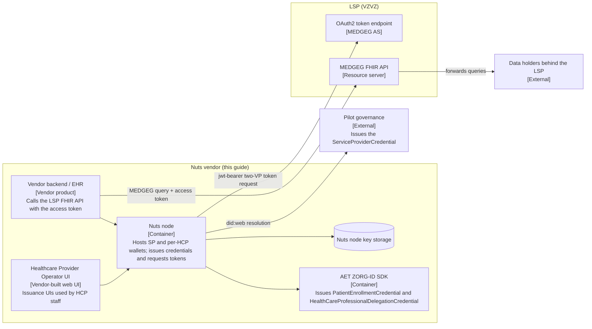
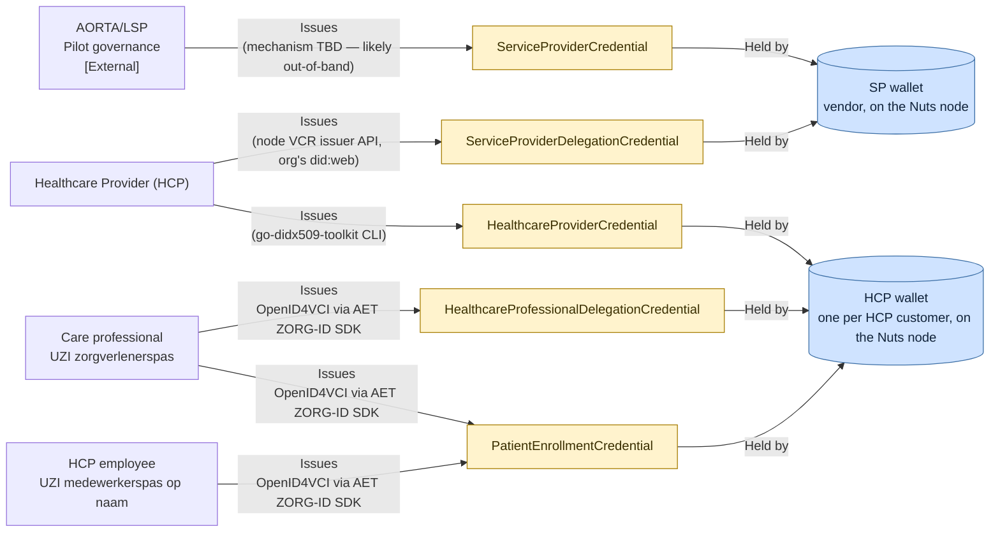

# LSPxNuts Medicatie Overdracht Pilot 1 participation guide for Nuts vendors

This document helps a Nuts vendor scope the work needed to participate in
the LSPxNuts Medicatie Overdracht Pilot 1. It describes what a
participating vendor builds, what they host, what is delivered to them,
and roughly how much effort each piece is. It is not an implementation
manual; the [deployment guide](deployment-guide.md), [provisioning
guide](provisioning-guide.md), and [data-querying guide](data-querying-guide.md)
cover the detailed setup, sample payloads, and API reference (see the
[docs index](README.md) for the full set).

## To be determined

Open items to resolve before this guide is final. Each is tracked in an issue
where one exists.

- **TLS/mTLS cert for the data connection** ([#2](https://github.com/nuts-foundation/lspxnuts-pilots/issues/2)). Nuts convention
  (nuts-node#4156): OAuth2 endpoints → public cert, data endpoints →
  PKIoverheid Private cert. VZVZ has proposed using the UZI certificate as the
  Nuts node's client certificate; the pilot team's position is against that,
  and a counter-proposal is being formulated for VZVZ.
- **How AORTA-afsprakenstelsel credential issuance works** ([#22](https://github.com/nuts-foundation/lspxnuts-pilots/issues/22), see also
  [#9](https://github.com/nuts-foundation/lspxnuts-pilots/issues/9)) — the issuer is AORTA/LSP;
  what's still open is the issuance process. Known so far: the vendor must
  conform to LSP/VZVZ's governance requirements (Pakket van Eisen, PvE)
  to apply; which requirements and how conformance is demonstrated is
  part of what's still being designed.
- **How vendors discover the LSP's endpoints** ([#13](https://github.com/nuts-foundation/lspxnuts-pilots/issues/13)) — GF Addressing, not ZORG-AB.
- **OAuth2 scope(s) for the AORTA-GtK access-token request** ([#20](https://github.com/nuts-foundation/lspxnuts-pilots/issues/20)) — to be designed.
- **Which FHIR queries Nuts parties perform** ([#21](https://github.com/nuts-foundation/lspxnuts-pilots/issues/21)) — to be designed.

## 1. Scope of this document

The pilot runs the two-VP (Verifiable Presentation) RFC 7523
jwt-bearer access-token flow for MEDGEG against the Authorization Server
(AS) hosted by VZVZ. There are several participant roles in the pilot.
This guide is aimed at the **Nuts vendors**: parties that operate Nuts
infrastructure and act in the OAuth requestor and client roles. The
Resource Server (RS) — the LSP FHIR API, operated by VZVZ — is out of
scope here.

A Nuts vendor hosts a Nuts node that contains wallets for:

- the vendor itself, as a Service Provider (SP), and
- each of the vendor's care-provider customers, each one a Healthcare
  Provider (HCP).

The vendor builds and operates the issuance UIs that HCP staff use to
manage their credentials. This document is not intended for the HCPs
themselves.

### Prerequisites at a glance

- [ ] Public `.nl` URL — the domain in the node's did:web DID (DNS, TLS, stable hostname)
- [ ] SQL database for node storage
- [ ] Key storage for signing keys (external store or on-disk)
- [ ] ZorgID agreement with AET (vendor; one per HCP too)
- [ ] Test smart cards from zorgcsp.nl
- [ ] Supported smart card reader (e.g. HID OMNIKEY 3121) — available to
      developers/testers, and on the workstations of staff doing patient
      enrollment and professional delegation during the pilot
- [ ] Workstation with the AET ZorgID app installed — same workstations as
      the smart card reader; does the UZI smartcard crypto and reaches the
      AET SDK's `/authorize` page during real smartcard issuance
- [ ] UZI server certificate — for the HealthcareProviderCredential (per HCP customer)
- [ ] Personal UZI care-professional card (zorgverlenerspas) — for the
      HealthcareProfessionalDelegationCredential; can also perform patient enrollment
- [ ] Personal UZI employee card (medewerkerspas op naam) — optional; patient
      enrollment only, not needed if the zorgverlenerspas is used

## 2. Effort buckets

Each subsection is marked with one of:

- S - up to half a day
- M - one to two days
- L - three days to a week
- XL - more than a week

These are rough estimates for a backend engineer with experience
operating containerized services but no Nuts-specific background.
Multiply if infrastructure changes have to go through a
change-management process. Items that scale per HCP customer are
flagged.

## 3. Reference architecture

```mermaid
flowchart LR
  subgraph Vendor["Nuts vendor (this guide)"]
    UI["Healthcare Provider Operator UI<br/>[Vendor-built web UI]<br/>Issuance UIs used by HCP staff"]
    Node["Nuts node<br/>[Container]<br/>Hosts SP and per-HCP wallets; issues credentials and requests tokens"]
    Backend["Vendor backend / EHR<br/>[Vendor product]<br/>Calls the LSP FHIR API with the access token"]
    Keys[("Nuts node key storage")]
    AET["AET ZORG-ID SDK<br/>[Container]<br/>Issues PatientEnrollmentCredential and HealthCareProfessionalDelegationCredential"]
    UI --> Node
    Backend --> Node
    Node --> Keys
    Node --> AET
  end

  Gov["Pilot governance<br/>[External]<br/>Issues the ServiceProviderCredential"]

  subgraph LSP["LSP (VZVZ)"]
    AS["OAuth2 token endpoint<br/>[MEDGEG AS]"]
    RS["MEDGEG FHIR API<br/>[Resource server]"]
  end

  Holders["Data holders behind the LSP<br/>[External]"]

  Node -->|did:web resolution| Gov
  Node -->|jwt-bearer two-VP token request| AS
  Backend -->|MEDGEG query + access token| RS
  RS -->|forwards queries| Holders
```

The vendor obtains the access token from the LSP OAuth2 token endpoint
(the MEDGEG AS) via the two-VP jwt-bearer flow, then uses it at the LSP
FHIR API (the MEDGEG resource server). The LSP forwards queries to the
data holders behind it.

## 4. Roles a Nuts vendor plays in the pilot

- OAuth **requestor and client**: the vendor's SP subject calls VZVZ to
  obtain a service access token, and the vendor's software then calls
  the MEDGEG resource server with that token.
- **Wallet operator for HCP customers**: the vendor hosts the wallet
  for every participating HCP and provides the issuance UIs through
  which HCP staff manage their credentials.

The MEDGEG resource server is the LSP FHIR API, operated by VZVZ. The
LSP forwards queries to the data holders behind it; what sits behind the
LSP is not visible to the vendor and is out of scope here.

## 5. Credentials and roles

Who issues each pilot credential, which protocol they use, and where it
ends up:

```mermaid
flowchart LR
  Gov["AORTA/LSP<br/>Pilot governance<br/>[External]"]
  HCP["Healthcare Provider (HCP)"]
  Prof["Care professional<br/>UZI zorgverlenerspas"]
  Employee["HCP employee<br/>UZI medewerkerspas op naam"]

  SPWallet[("SP wallet<br/>vendor, on the Nuts node")]
  HCPWallet[("HCP wallet<br/>one per HCP customer, on the Nuts node")]

  SPC["ServiceProviderCredential"]
  SPDC["ServiceProviderDelegationCredential"]
  HPC["HealthcareProviderCredential"]
  HPDC["HealthcareProfessionalDelegationCredential"]
  PEC["PatientEnrollmentCredential"]

  Gov -->|"Issues<br/>(mechanism TBD — likely out-of-band)"| SPC
  SPC -->|Held by| SPWallet

  HCP -->|"Issues<br/>(node VCR issuer API, org's did:web)"| SPDC
  SPDC -->|Held by| SPWallet

  HCP -->|"Issues<br/>(go-didx509-toolkit CLI)"| HPC
  HPC -->|Held by| HCPWallet

  Prof -->|"Issues<br/>OpenID4VCI via AET ZORG-ID SDK"| HPDC
  HPDC -->|Held by| HCPWallet

  Prof -->|"Issues<br/>OpenID4VCI via AET ZORG-ID SDK"| PEC
  Employee -->|"Issues<br/>OpenID4VCI via AET ZORG-ID SDK"| PEC
  PEC -->|Held by| HCPWallet

  classDef wallet fill:#cfe3ff,stroke:#3b6ea5,color:#11233a;
  classDef credential fill:#fff3cd,stroke:#a67c00,color:#3a2f00;
  class SPWallet,HCPWallet wallet;
  class SPC,SPDC,HPC,HPDC,PEC credential;
```

- `HealthcareProviderCredential` is self-issued: its actual issuer is a
  `did:x509` derived from the HCP's UZI server certificate, not the HCP's
  regular DID — drawn here as "HCP issues" for simplicity.
- `HealthcareProfessionalDelegationCredential` and `PatientEnrollmentCredential`
  are signed by the AET ZORG-ID SDK, using the private key bound to the
  professional's/employee's UZI smartcard — drawn here as the card holder
  issuing, since that's whose identity the credential asserts.
- `KwalificatieCredential` (GBZ qualification, part 2 scope) is left out —
  not part of Pilot 1's credential set (see the TBD list, #9/#22).
- `ServiceProviderDelegationCredential`'s issuer is drawn as the HCP org, but
  in the pilot the vendor self-issues it on the HCP's behalf (B.3.a).

See the [provisioning guide](provisioning-guide.md) for the request/response
details behind each of these.

---

## Part A - Hosting a Nuts node

### A.1 Prerequisites (M-L)

The prerequisites split into infrastructure (set up by ops/engineering) and
paperwork/agreements (often owned by a different person, with longer lead
times). **Start the paperwork early:** UZI certificate acquisition alone takes
at least two weeks; begin acquiring certificates and putting agreements
(ZorgID, AET) in place at least a month before integration work starts.

**Infrastructure**

- A participant-controlled public URL on a `.nl` domain — this is the domain in
  the node's did:web (Decentralized Identifier, web method) DID and must resolve
  back to the node. The `.nl` domain is a pilot requirement; DNS, TLS, and a
  stable hostname need to be in place. Recommendation: serve the node at the
  root of the (sub)domain, otherwise the `.well-known` endpoints need awkward
  URL rewriting.
- A **SQL database** for the node's storage. Any database supported by the Nuts
  node works (PostgreSQL, SQL Server, MySQL); SQLite is best kept to development
  environments. BBolt is used only for gRPC connection storage. On-disk storage
  does not need to be persistent unless signing keys are kept there.
- **Key storage** for the node's signing keys: an external key store (HashiCorp
  Vault or Azure Key Vault) is recommended. On-disk storage is also supported,
  but then the vendor is responsible for securing encryption and data at rest.
- At least one **supported smart card reader** (for example, the HID OMNIKEY
  3121) for the workstations that run the issuance UIs.
- The **AET ZorgID app** installed on those same workstations — it does the
  UZI smartcard crypto via the reader, and is what the browser reaches when
  redirected to the AET SDK's `/authorize` page during real smartcard
  issuance (see B.1).

**Paperwork / agreements**

- Conformance to LSP/VZVZ's governance requirements (Pakket van Eisen, PvE)
  — required before the `ServiceProviderCredential` can be applied for.
  Scope and process still being designed ([#22](https://github.com/nuts-foundation/lspxnuts-pilots/issues/22)).
- A **ZorgID agreement** with AET for the vendor (each participating HCP needs
  their own agreement as well).
- **Test smart cards** from `zorgcsp.nl`. Soft test certificates (provided by
  the pilot team, #12) can be used during early development so developers do not
  need physical cards; physical test cards have to be requested before the
  issuance flows can be validated against the real workstation experience.
- **UZI material per HCP customer**. The HCP organisation requests this
  themselves; the vendor does not request it on the HCP's behalf. Where an HCP
  already holds UZI cert material at another vendor, do not share private key
  material between vendors — the HCP requests a separate cert per vendor.
  - a **UZI server certificate** for the `HealthcareProviderCredential` (Part B);
  - a personal **zorgverlenerspas** (UZI-pas zorgverlener op naam) for the
    `HealthCareProfessionalDelegationCredential`; it can also perform patient
    enrollment;
  - optionally a personal **medewerkerspas op naam** (UZI-pas medewerker op
    naam) for patient enrollment — not needed if the zorgverlenerspas is used.

The Nuts node authenticates to the AET ZORG-ID SDK via a registered OIDC
client; [Register the OIDC client through VZVZ](https://vzvz.atlassian.net/helpcenter/zorg-id/portal/11/group/377/create/1703).

Note that the Healthcare Provider and Service Provider credentials themselves
are not prerequisites; they are issued or loaded once the node is running and
DIDs exist (see Part B).

### A.2 Base image and configuration (S)

- A pinned `nuts-node` container image is available for the pilot
  window. The released binary covers everything the pilot needs, and
  the AET and other required certificate authorities are baked into the
  image.
- Configuration is a single `nuts.yaml`. The pilot-specific bits
  beyond a default install are:
  - the public `.nl` URL for did:web resolution
  - `auth.experimental.jwtbearerclient: true` (gates the two-VP flow)
  - the crypto backend pointing at the configured key storage
- Strict mode on. The internal API is bound to a private interface;
  the vendor decides how to authenticate operators in front of it.

### A.3 Entity management (M)

The vendor needs to create and manage:

- one SP subject (the vendor itself), and
- one HCP subject per care-provider customer.

Two equivalent options for the management surface:

- **Use `nuts-admin`** - the foundation publishes a ready-made web UI
  image. Point it at the node's internal API and it provides a console
  for subject, DID, and credential management. Zero code; S effort.
- **Implement the VDR (Verifiable Data Registry) endpoints in own
  admin tooling** - if the vendor prefers a single admin surface for
  their operators (and likely for their customer onboarding flow),
  integrate the `/internal/vdr/v2/...` calls into the existing
  console. M effort.

Per-customer onboarding ergonomics matter here: every new HCP customer
needs a subject created and a DID issued before any of the Part B
credential work can proceed for that customer.

### A.4 Operational concerns (S)

- Healthcheck endpoints exposed by the node.
- Log routing and verbosity choices for pilot vs production.
- Vault key rotation procedure documented; the vendor decides the
  rotation cadence.

### Part A total

A vendor with experience operating containerized services and key
storage in production can expect **3-5 working days** end-to-end for
Part A, dominated by the key storage integration and the subject
management surface.

---

## Part B - Additional API calls and workflow integration

This is the larger of the two parts. The vendor integrates two new Nuts
endpoints, hosts the AET SDK, populates the wallet for every customer,
and builds three UIs that fit into three different points in HCP staff
workflows.

_Exact request/response shapes for the endpoints below are in the
[provisioning guide](provisioning-guide.md) and [data-querying
guide](data-querying-guide.md); the counts below describe the integration
surface qualitatively._

### B.1 AET ZORG-ID SDK hosting (M-L)

The AET SDK runs alongside the Nuts node. The pilot uses the SDK in
production posture: real UZI / HSM-backed cert material, no soft-cert
shortcuts. It needs two network paths: a backend path from the Nuts
node (all credential requests), and a front-channel path reachable by
the issuance workstation's browser — real smartcard issuance redirects
the browser to AET's own `/authorize` page for card/PIN entry. See the
[deployment guide](deployment-guide.md#3-zorg-id-sdk-deployment) for
the endpoint list and OAuth client registration requirement.

The AET SDK is not redistributed as part of the pilot; the vendor
[registers as a software vendor with VZVZ](https://vzvz.atlassian.net/helpcenter/zorg-id/portal/11)
and requests the image through developer support.

### B.2 Wallet bootstrap per subject (S, scales per HCP customer)

Once the node is up and subjects + DIDs exist, every wallet needs to
be seeded with its baseline VC (Verifiable Credential) before any
token request can succeed.

- **SP subject (vendor)**: load the `ServiceProviderCredential` issued
  by Pilot governance. The signed VC is handed over out-of-band as
  part of pilot onboarding and loaded via
  `POST /internal/vcr/v2/holder/<subject>/vc`. One-off per environment.
- **HCP subject (per customer)**: generate the
  `HealthcareProviderCredential` for that HCP using the
  `go-didx509-toolkit` CLI against the HCP's UZI material, then load
  it via the same wallet endpoint. Using the CLI directly is fine for
  the pilot.

### B.3 Three issuance touchpoints (the real Part B work)

Three different credentials need to be issued during normal pilot
operation, each at a different place in HCP staff workflows. The
vendor builds the UI; the Nuts API calls behind it are thin. End-users
of all three UIs are HCP staff, segmented by role.

For the AET-signed credentials (B.3.b and B.3.c), the issuance has to
be performed by a healthcare professional holding a UZI smart card, at
a workstation that has a smart card reader and ZorgID (AET) installed.
During development the workstation requirement can be relaxed by
configuring soft certificates, so engineers do not need a physical
card to run the flow. Test cards from `zorgcsp.nl` are required
before the UIs can be validated end-to-end as HCP staff will use them.

#### B.3.a Service Provider Delegation (L)

- **When**: once per HCP-vendor relationship; refreshed only on
  contract changes.
- **Who**: an authorised signer at the HCP organisation (someone who
  can bind the organisation to a service contract).
- **What**: the HCP issues a `ServiceProviderDelegationCredential` to
  the vendor's SP subject. The credential template is provided by the
  pilot; the signing UI is built by the vendor.
- **Where it lives in the vendor's product**: a governance /
  contracting area gated by signatory role. Likely a net-new screen
  for most vendors.
- **Workstation requirement**: none; the signing authority operates
  inside the vendor's product directly.

#### B.3.b Healthcare Professional Delegation (M)

- **When**: when an HCP onboards or rotates a professional, or when a
  role changes.
- **Who**: HR or staff admin at the HCP, signing with their UZI smart
  card.
- **What**: an AET-signed `HealthCareProfessionalDelegationCredential`
  requested through Nuts via
  `/internal/auth/v2/<subject>/request-credential` with
  `credential_request_params` carrying the AET-specific fields.
- **Where it lives in the vendor's product**: HR / staff admin
  tooling. Often an extension of an existing onboarding screen.
- **Workstation requirement**: UZI smart card + reader + ZorgID
  installed on the workstation that runs the issuance.

#### B.3.c Patient Enrollment (L-XL)

- **When**: every time a patient is enrolled at the HCP for medication
  treatment. High volume.
- **Who**: clinical or front-desk staff at the HCP, signing with
  their UZI smart card.
- **What**: an AET-signed `PatientEnrollmentCredential` requested
  through the same `/request-credential` endpoint with the patient's
  BSN in `credential_request_params`.
- **Where it lives in the vendor's product**: embedded in the EHR
  (Electronic Health Record) or registration workflow. Latency and
  error UX matter; HCP users will hit this daily.
- **Workstation requirement**: same as B.3.b - UZI smart card +
  reader + ZorgID installed on every workstation that will perform
  the enrolment.

See the [UX considerations](ux-considerations.md) doc.

The three together are where most of the Part B effort lives. If the
vendor's product makes back-office HTTP calls easy and the
governance / HR / clinical surfaces are extensible, the work is
straightforward integration. If any of those surfaces are hard to
modify, those constraints dominate the estimate.

### B.4 Two-VP service access token (M)

The core of the pilot. Once the wallets are populated, the vendor's
SP requests a service access token via
`POST /internal/auth/v2/<hcp>/request-service-access-token` with the
SP subject id in the request. Nuts builds two presentations (one per
subject), assembles them as `assertion` and `client_assertion`, and
posts the token request to VZVZ. The response carries an access token
that the vendor's software attaches to outbound MEDGEG calls.

The integration surface is a single HTTP call from the vendor's
backend plus response handling. The complexity sits in the wallet
being correctly populated and the scopes requested being ones VZVZ
has configured for the vendor. Scope onboarding with VZVZ runs in
parallel during pilot onboarding.

### B.5 Presentation Definitions (S)

The PD (Presentation Definition) JSON files are provided by the
pilot. The vendor drops them in the configured policy directory.

### B.6 Credential lifecycle (S)

The Nuts node exposes list and delete endpoints on the holder wallet,
and `nuts-admin` exposes the same operations through its UI. The
vendor will want a way to list and delete credentials in their
operations toolkit, since re-issuance can leave duplicates that
complicate matching. It is a single API call; worth having from day
one.

### Part B total

For a vendor with a product backend that can make outbound HTTP calls
and customer-facing surfaces (governance, HR, clinical) that are
reasonably extensible: **8-12 working days** end-to-end, dominated by
the patient enrolment UI integration. Add buffer per HCP customer for
the wallet bootstrap.

---

## Part C - EHR / product integration (M)

Once the access token is in hand, calling MEDGEG is a normal
authorised HTTP call. The pilot scope here is:

- Construct the MEDGEG medication-request call using the token from
  Part B.
- Attach the token at the right point in the outbound HTTP layer.
- Parse the response and display the medication overview to the HCP
  user.
- Handle the error path: token denied, no data, AS or resource server
  unreachable.

Most vendors already have all of this plumbing for other federated
services; the pilot-specific surface is small. Effort sits at M for
vendors with a clean outbound integration layer, L if every new
external call requires significant new UI work.

---

## Reference materials

- A working **demo stack** (`docker compose up`) covering the full
  end-to-end flow with a mock AS, mock issuers, the AET SDK in dev
  mode, and a UI for issuing every credential and requesting tokens.
  Useful as a sanity check before cutting real code.
- **Sample payloads** for every API call (request and response) and
  **sample wallet states** for each subject type — see the
  [provisioning guide](provisioning-guide.md) and [data-querying
  guide](data-querying-guide.md).
- **Sample full flow trace** from wallet bootstrap through token
  response — the same two guides, read in sequence.
- Pointers to AET documentation, `go-didx509-toolkit`, `nuts-admin`,
  and the supported vault backends.
- The pinned `nuts-node` container image tag and the matching PD
  bundle.
- **Developer support**: questions during the pilot integration can
  be raised in the Nuts foundation Slack workspace. The pilot test
  plan and acceptance criteria are delivered as a separate document
  during onboarding.

---

## Total effort estimate

For a vendor with experience operating containerized services, an
extensible product backend, governance / HR / clinical surfaces that
can be modified, and key storage already in production:

- Part A: 3-5 days
- Part B: 8-12 days
- Part C: 2-5 days
- Buffer for coordination handoffs and change management: 2-4 days

**Total: 3-5 working weeks** of focused backend + UI effort for a
single team, plus calendar time for the prerequisite handoffs (AET
licensing, ZorgID agreement, smart card / test cert procurement from
`zorgcsp.nl`, Pilot governance SP VC handoff, VZVZ scope onboarding)
which run in parallel. Add per-HCP-customer onboarding effort once
the baseline integration is in place.
