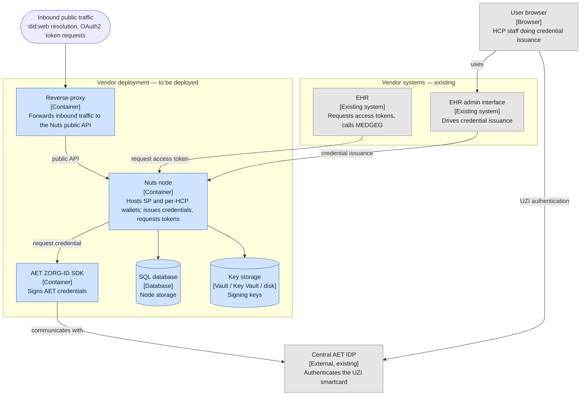

# LSPxNuts Medicatie Overdracht Pilot 1 deployment guide

> **OUTLINE — content to follow.** This guide covers standing up and running the
> infrastructure a vendor hosts: the Nuts node, the AET ZORG-ID SDK, key storage,
> and supporting services. The [participation guide](LSPxNuts-participation-guide.md)
> scopes the work; API integration is in the [integration guide](integration-guide.md).

## Conventions used in this guide

- Pinned versions: `nuts-node` image tag, AET SDK version, PD bundle version —
  stated once here.
- Placeholders: `<node-url>` (public `.nl` URL), `<db-dsn>`, `<vault-addr>`.
- Examples target the demo stack (`docker compose up`); production differences
  called out inline.

## 1. Prerequisites

> Participation guide A.1. Split infrastructure vs paperwork; flag long lead
> times.
- Public `.nl` URL (DNS, TLS, stable hostname; serve at root)
- SQL database (supported engines; SQLite dev-only)
- Key storage (Vault / Azure Key Vault / on-disk)
- Smart card reader(s) on issuance workstations
- Paperwork: ZorgID agreement, test smart cards, UZI material — pointers, not
  steps (those live in the participation guide).

## 2. Architecture & components

Deployment view. Components in blue are deployed by the vendor for the pilot;
grey are existing systems the vendor already runs or that exist externally.

Components:
- **Reverse proxy** — terminates inbound public traffic, forwards to the Nuts
  public API (OAuth2 + `.well-known`/did:web).
- **Nuts node** — central component; calls the AET SDK to acquire credentials,
  persists to the SQL database, signs with key storage.
- **AET ZORG-ID SDK** — deployed by the vendor; signs AET credentials.
- **SQL database**, **key storage** — node backing services.
- **EHR** (existing) — acquires access tokens from the node.
- **EHR admin interface** (existing) — drives credential issuance via the node.
- **Central AET IDP** (external, existing) — the user's browser authenticates
  the UZI smartcard against it, and the AET SDK communicates with it; not
  deployed by the vendor.

## 3. Nuts node deployment

> Participation guide A.2.
- Pinned image + how to pull it
- `nuts.yaml` reference: every pilot-relevant setting, annotated
  - public `.nl` URL for did:web
  - `auth.experimental.jwtbearerclient: true`
  - crypto backend → key storage
  - JSON-LD context mappings (if required, #6)
  - strict mode + private binding of the internal API
- Storage wiring (SQL DSN, BBolt for gRPC)
- PD bundle: where to drop the policy files
- Startup verification (healthcheck, did:web resolves).

## 4. Key storage setup

- Vault / Azure Key Vault configuration
- On-disk option and its at-rest responsibilities
- Key rotation procedure + cadence (vendor decides).

## 5. AET ZORG-ID SDK deployment

> Participation guide B.1.
- Obtaining the image (AET licensing; not redistributed — #10)
- Running it alongside the node: stable HTTPS endpoint reachable from the node
- mTLS / certificate binding / network exposure → AET docs (link, don't copy)
- How the node authenticates to the SDK (#11, TBD)
- Soft-cert dev posture vs production (real UZI/HSM) — #12.

## 6. TLS / certificates

> Filled in once #2 is decided. Nuts convention (nuts-node#4156): OAuth2
> endpoints → public cert, data endpoints → PKIoverheid Private cert.
- Where each cert is configured
- CA trust (AET + others baked into the image).

## 7. Operations

> Participation guide A.4.
- Healthcheck endpoints + what to alert on
- Log routing and verbosity (pilot vs production)
- Backup / restore (DB, keys)
- Upgrade path within the pilot window.

## 8. Demo stack

- `docker compose up`: what it brings up (mock AS, mock issuers, AET dev mode, UI)
- How it differs from a real deployment
- Using it as a pre-flight sanity check.

## Appendix: pinned versions

Single table of every pinned tag/version, kept in sync with the demo stack and
the integration guide.
