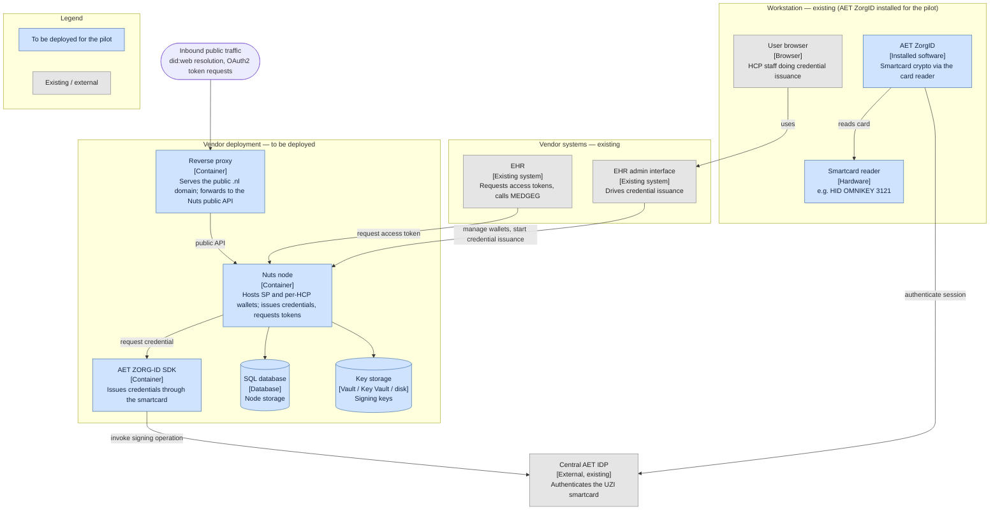

# LSPxNuts Medicatie Overdracht Pilot 1 deployment guide

This guide covers the infrastructure required for participating in the LSPxNuts pilot.

## 1. Architecture & components

Deployment view. Components in blue are deployed by the vendor for the pilot;
grey are existing systems the vendor already runs or that exist externally.

Components:
- **Reverse proxy** — serves the public `.nl` domain (required for did:web
  resolution), terminates inbound traffic, forwards to the Nuts public API
  (OAuth2 + `.well-known`/did:web).
- **Nuts node** — central component; calls the AET SDK to acquire credentials,
  persists to the SQL database, signs with key storage.
- **AET ZORG-ID SDK** — deployed by the vendor; issues credentials through the
  smartcard, invoking signing operations at the central AET IDP.
- **SQL database**, **key storage** — node backing services.
- **EHR** (existing) — acquires access tokens from the node.
- **EHR admin interface** (existing) — manages wallets and starts credential
  issuance via the node.
- **Workstation** (existing) — runs the user's browser, **AET ZorgID** (the
  installed software that does the UZI smartcard crypto), and a **smartcard
  reader**. ZorgID must be installed on every workstation that performs issuance.
- **Central AET IDP** (external, existing) — workstation AET ZorgID authenticates
  the session against it, and the AET SDK invokes signing operations on it; not
  deployed by the vendor.

## 2. Nuts node deployment

- Docker image: TBD
- Configuration (also see [documentation](https://nuts-node.readthedocs.io/en/stable/pages/deployment/configuration.html)):  
  - Properties:
    - `url`: public base URL of the Nuts node
    - `crypto.storage`: configure, depending on key storage
    - `http.internal.address`: set to `0.0.0.0:8081` for internal API access from outside container
    - `auth.experimental.jwtbearerclient` set to `true` to enable two-VP bearer token flow
    - `storage.sql.connection`: configure, depending on SQL database
  - Files:
    - Mount policy file (TBD: add link) into `/nuts/config/policy/`

## 3. Key storage setup

- Vault / Azure Key Vault configuration
- On-disk option and its at-rest responsibilities
- Key rotation procedure + cadence (vendor decides).

## 4. AET ZORG-ID SDK deployment

> Participation guide B.1.
- Obtaining the image (AET licensing; not redistributed — #10)
- Running it alongside the node: stable HTTPS endpoint reachable from the node
- mTLS / certificate binding / network exposure → AET docs (link, don't copy)
- How the node authenticates to the SDK (#11, TBD)
- Soft-cert dev posture vs production (real UZI/HSM) — #12.

## 5. TLS / certificates

> Filled in once #2 is decided. Nuts convention (nuts-node#4156): OAuth2
> endpoints → public cert, data endpoints → PKIoverheid Private cert.
- Where each cert is configured
- CA trust (AET + others baked into the image).

## 6. Operations

> Participation guide A.4.
- Healthcheck endpoints + what to alert on
- Log routing and verbosity (pilot vs production)
- Backup / restore (DB, keys)
- Upgrade path within the pilot window.

## 7. Demo stack

- `docker compose up`: what it brings up (mock AS, mock issuers, AET dev mode, UI)
- How it differs from a real deployment
- Using it as a pre-flight sanity check.

## Appendix: pinned versions

Single table of every pinned tag/version, kept in sync with the demo stack and
the integration guide.
